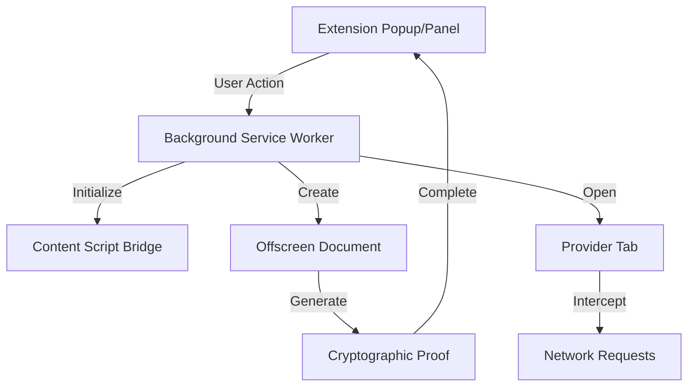

## Overview

Build browser extensions with Reclaim verification in popup/sidepanel. The SDK handles Chrome Manifest V3 complexity including service workers, offscreen documents, and content script orchestration.

<Callout type="info">
**Primary Integration Path**: This is the main way to use the SDK. Users trigger verification from your extension UI (popup/sidepanel). For triggering verification from a website, see [Web Integration](/browser-extension/web-integration).
</Callout>

## When to Use Extension Integration

Choose this integration approach if you are:

- 🔧 **Building a browser extension** from scratch or adding to an existing one
- 🎯 **Controlling the entire user experience** within your extension
- 🔌 **Creating popup or side panel interfaces** that trigger verification
- 🛠️ **Developing productivity tools** that need provider data verification

## What You'll Build

By following this guide, you'll create a browser extension that can:

- Trigger Reclaim verification flows from extension popups or side panels
- Manage provider authentication tabs automatically
- Generate cryptographic proofs using WebAssembly
- Handle verification completion events
- Securely communicate between extension components

## Architecture Overview

Extension integration involves three main components:



### Components Explained

**Extension Popup/Panel**
- Your extension's user interface (HTML/CSS/JS)
- Initiates verification requests
- Displays results and handles user interactions

**Background Service Worker**
- Chrome Manifest V3 background script
- Coordinates between all components
- Manages extension lifecycle and permissions

**Content Script Bridge**
- Injected into web pages
- Enables communication with provider pages
- Handles message routing

**Offscreen Document**
- Hidden document for WebAssembly execution
- Generates cryptographic proofs
- Required for Manifest V3 architecture

**Provider Tab**
- Automatically opened during verification
- Hosts the provider authentication flow
- Monitored by network interceptor

## Integration Steps

The integration process consists of four main steps:

### 1. Manifest Configuration

Configure your Chrome extension's `manifest.json` with required permissions, content security policies, and web-accessible resources.

[Configure Manifest →](/browser-extension/extension-integration/manifest-configuration)

### 2. Background Initialization

Initialize the SDK in your background service worker to enable offscreen document management and message handling.

[Set Up Background →](/browser-extension/extension-integration/setup#background-initialization)

### 3. Content Script Loading

Load the SDK's content script bridge to enable communication between your extension and web pages.

[Load Content Script →](/browser-extension/extension-integration/setup#content-script-loading)

### 4. Implement Verification Flow

Use the SDK's API in your popup or panel to trigger verification and handle results.

[Implement Usage →](/browser-extension/extension-integration/usage)

## Prerequisites

Before starting, ensure you have:

- ✅ Completed the [Installation guide](/browser-extension/installation)
- ✅ Basic understanding of Chrome extension development
- ✅ Familiarity with JavaScript Promises and async/await
- ✅ A Chrome extension project with Manifest V3

## Get Your API Credentials

<Callout type="warning">
**🔑 Required: Get Your API Credentials First**

Before you proceed with any integration steps, you **must** obtain your API credentials. These credentials (`APP_ID` and `APP_SECRET`) are essential for initializing the SDK and creating verification requests.

**[Get Your API Credentials Now →](/api-key)**

You'll need:
- **`APP_ID`**: Your unique application identifier
- **`APP_SECRET`**: Your application secret key (keep secure!)

Without these credentials, you cannot complete the integration steps below.
</Callout>

## Security Considerations

### Content Security Policy

The SDK requires specific CSP settings for WebAssembly execution:

```json
"content_security_policy": {
  "extension_pages": "script-src 'self' 'wasm-unsafe-eval'; object-src 'self';"
}
```

<Callout type="warning">
**Why `wasm-unsafe-eval`?** This directive is required for WebAssembly instantiation in Manifest V3. While the name includes "unsafe," it's the only way to run WebAssembly in Chrome extensions and is considered acceptable for this specific use case.
</Callout>

### Permissions

The SDK needs specific permissions:

- **`offscreen`**: Create offscreen documents for proof generation
- **`cookies`**: Access provider cookies during verification
- **`<all_urls>`**: Inject content scripts and intercept network requests

### Best Practices

1. **Never expose credentials in client code**: Use environment variables or secure configuration
2. **Validate all user inputs**: Before passing to verification flows
3. **Handle errors gracefully**: Implement proper error boundaries
4. **Clear sensitive data**: After verification completes
5. **Use server-side validation**: For production deployments

<Callout type="info">
For production applications, generate verification requests server-side and only pass the configuration to the client. This prevents exposure of your application secret. Learn more about [server-side configuration](#) (coming soon).
</Callout>

## Browser Compatibility

This integration works with Chromium-based browsers supporting Manifest V3:

| Browser | Minimum Version | Status |
|---------|----------------|---------|
| Chrome | 93+ | ✅ Fully Supported |
| Edge | 93+ | ✅ Fully Supported |
| Brave | Latest | ✅ Fully Supported |
| Opera | Latest (Chromium) | ✅ Fully Supported |
| Firefox | - | ⏳ Coming Soon |
| Safari | - | ⏳ Coming Soon |

## Example Extension

For a complete working example, check out our [sample extension](https://github.com/reclaimprotocol/reclaim-browser-extension-sdk) (link to be added).

## Next Steps

Start with manifest configuration:

**[Configure Your Manifest →](/browser-extension/extension-integration/manifest-configuration)**
