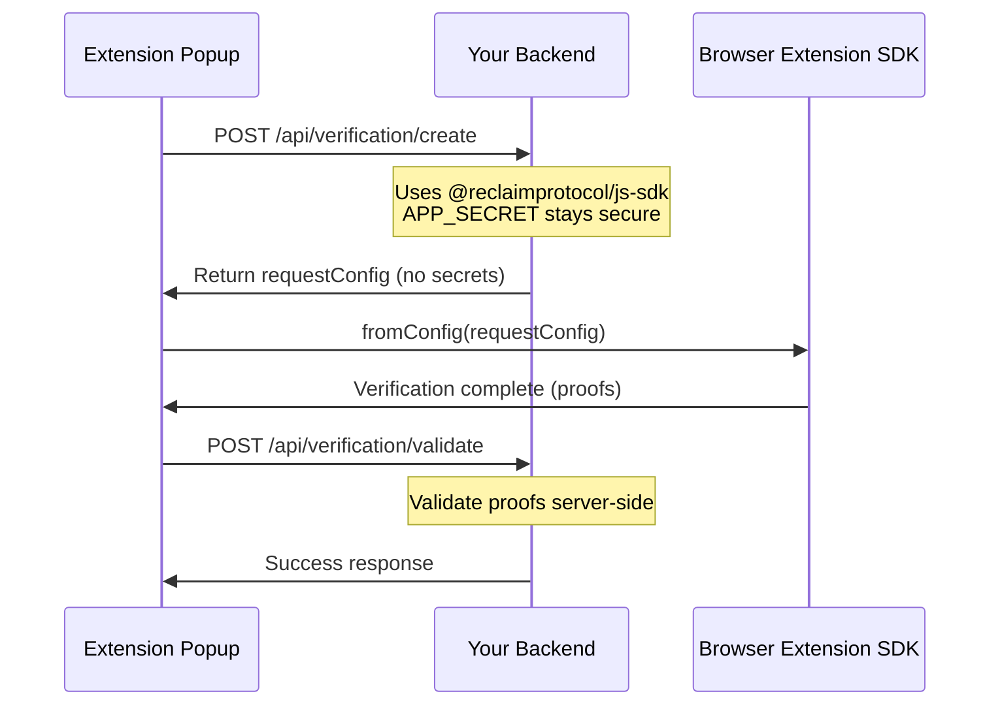

## Overview

With the SDK initialized and configured, you can now implement verification flows in your extension's user interface. This guide covers implementing verification in popups, side panels, and handling the complete verification lifecycle.

## Prerequisites

Before implementing verification flows, ensure you have:

- ✅ Completed [Manifest Configuration](/browser-extension/extension-integration/manifest-configuration)
- ✅ Completed [Background Setup](/browser-extension/extension-integration/setup)
- ✅ Obtained API credentials from the [API Key guide](/api-key)

## Basic Popup Implementation

### HTML Structure

Create a simple popup interface (`popup.html`):

```html
<!DOCTYPE html>
<html>
<head>
  <meta charset="UTF-8">
  <title>Reclaim Verification</title>
  <style>
    body {
      width: 350px;
      padding: 20px;
      font-family: system-ui, -apple-system, sans-serif;
    }

    .form-group {
      margin-bottom: 15px;
    }

    label {
      display: block;
      margin-bottom: 5px;
      font-weight: 500;
      color: #333;
    }

    input {
      width: 100%;
      padding: 8px;
      border: 1px solid #ddd;
      border-radius: 4px;
      box-sizing: border-box;
    }

    button {
      width: 100%;
      padding: 10px;
      background: #4CAF50;
      color: white;
      border: none;
      border-radius: 4px;
      cursor: pointer;
      font-size: 14px;
      font-weight: 500;
    }

    button:hover {
      background: #45a049;
    }

    button:disabled {
      background: #ccc;
      cursor: not-allowed;
    }

    .status {
      margin-top: 15px;
      padding: 10px;
      border-radius: 4px;
      font-size: 13px;
    }

    .status.info {
      background: #e3f2fd;
      color: #1976d2;
    }

    .status.success {
      background: #e8f5e9;
      color: #388e3c;
    }

    .status.error {
      background: #ffebee;
      color: #c62828;
    }

    pre {
      background: #f5f5f5;
      padding: 10px;
      border-radius: 4px;
      overflow-x: auto;
      font-size: 11px;
      max-height: 300px;
      overflow-y: auto;
    }
  </style>
</head>
<body>
  <h2>Reclaim Verification</h2>

  <div class="form-group">
    <label for="appId">Application ID</label>
    <input type="text" id="appId" placeholder="Enter your Application ID" />
  </div>

  <div class="form-group">
    <label for="appSecret">Application Secret</label>
    <input type="password" id="appSecret" placeholder="Enter your Application Secret" />
  </div>

  <div class="form-group">
    <label for="providerId">Provider ID</label>
    <input type="text" id="providerId" placeholder="e.g., google-login" />
  </div>

  <button id="startBtn">Start Verification</button>

  <div id="status"></div>
  <pre id="output"></pre>

  <script src="popup.js" type="module"></script>
</body>
</html>
```

### JavaScript Implementation

Create the popup logic (`popup.js`):

```javascript
import { reclaimExtensionSDK } from "@reclaimprotocol/browser-extension-sdk";

// DOM elements
const appIdInput = document.getElementById("appId");
const appSecretInput = document.getElementById("appSecret");
const providerIdInput = document.getElementById("providerId");
const startBtn = document.getElementById("startBtn");
const statusDiv = document.getElementById("status");
const outputPre = document.getElementById("output");

// Helper functions
function showStatus(message, type = "info") {
  statusDiv.className = `status ${type}`;
  statusDiv.textContent = message;
  statusDiv.style.display = "block";
}

function showOutput(data) {
  outputPre.textContent = JSON.stringify(data, null, 2);
}

function clearOutput() {
  outputPre.textContent = "";
  statusDiv.style.display = "none";
}

// Start verification
startBtn.addEventListener("click", async () => {
  // Get form values
  const appId = appIdInput.value.trim();
  const appSecret = appSecretInput.value.trim();
  const providerId = providerIdInput.value.trim();

  // Validate inputs
  if (!appId || !appSecret || !providerId) {
    showStatus("Please fill in all fields", "error");
    return;
  }

  // Clear previous output
  clearOutput();

  // Disable button during verification
  startBtn.disabled = true;
  startBtn.textContent = "Initializing...";

  try {
    // Initialize verification request
    showStatus("Initializing verification...", "info");

    const request = await reclaimExtensionSDK.init(
      appId,
      appSecret,
      providerId
    );

    // Set up event listeners
    request.on("started", ({ sessionId }) => {
      console.log("Verification started:", sessionId);
      showStatus(`Verification started. Session: ${sessionId}`, "info");
      startBtn.textContent = "Verifying...";
    });

    request.on("completed", (proofs) => {
      console.log("Verification completed:", proofs);
      showStatus("Verification completed successfully!", "success");
      showOutput(proofs);
      startBtn.disabled = false;
      startBtn.textContent = "Start Verification";
    });

    request.on("error", (error) => {
      console.error("Verification error:", error);
      showStatus(`Error: ${error?.message || error}`, "error");
      showOutput({ error: error?.message || String(error) });
      startBtn.disabled = false;
      startBtn.textContent = "Start Verification";
    });

    // Verification initialized successfully
    showStatus("Verification request created. Waiting for user...", "info");

  } catch (error) {
    console.error("Initialization error:", error);
    showStatus(`Failed to initialize: ${error?.message || String(error)}`, "error");
    startBtn.disabled = false;
    startBtn.textContent = "Start Verification";
  }
});

// Optional: Load saved credentials on popup open
chrome.storage.local.get(["appId", "providerId"], (result) => {
  if (result.appId) appIdInput.value = result.appId;
  if (result.providerId) providerIdInput.value = result.providerId;
});

// Optional: Save credentials for convenience
appIdInput.addEventListener("blur", () => {
  chrome.storage.local.set({ appId: appIdInput.value.trim() });
});

providerIdInput.addEventListener("blur", () => {
  chrome.storage.local.set({ providerId: providerIdInput.value.trim() });
});
```

<Callout type="warning">
**Security Note**: Never store `appSecret` in `chrome.storage`. In production, generate verification requests server-side and only pass the configuration to the client. The example above is for demonstration only.
</Callout>

## Event Handling

The SDK uses an event-driven API. Here are all available events:

### `started` Event

Fired when verification session begins.

```javascript
request.on("started", ({ sessionId }) => {
  console.log("Session started:", sessionId);
  // Update UI to show verification in progress
});
```

**Payload**:
- `sessionId` (string): Unique identifier for this verification session

**Use Cases**:
- Show loading states
- Track session for analytics
- Store session ID for debugging

### `completed` Event

Fired when verification succeeds and proofs are generated.

```javascript
request.on("completed", (proofs) => {
  console.log("Proofs received:", proofs);

  // Send to your backend for validation
  sendProofsToBackend(proofs);

  // Update UI
  showSuccessMessage();
});
```

**Payload**:
- `proofs` (object): Contains verification proofs and metadata

**Typical Proof Structure**:
```json
{
  "claimData": {
    "provider": "google-login",
    "context": "0x...",
    "identifier": "user@example.com",
    "parameters": "{...}"
  },
  "signedClaim": {
    "claim": {...},
    "signatures": ["0x..."]
  }
}
```

**Use Cases**:
- Send proofs to backend for validation
- Store proofs for later use
- Display verification success to user
- Update application state

### `error` Event

Fired when verification fails or is cancelled.

```javascript
request.on("error", (error) => {
  console.error("Verification failed:", error);

  if (error.message?.includes("cancelled")) {
    // User cancelled verification
    showCancelledMessage();
  } else {
    // Other errors
    showErrorMessage(error.message);
  }
});
```

**Payload**:
- `error` (Error | string): Error object or message

**Common Error Types**:
- User cancelled verification
- Network errors
- Invalid credentials
- Session timeout
- Provider authentication failed


## Server-Side Configuration (Recommended for Production)

<Callout type="warning">
**🔒 Production Security Best Practice**

For production deployments, **generate verification requests on your backend** instead of exposing credentials in your extension popup/panel.

**Why this approach:**
- ✅ **Keeps secrets secure** - `APP_ID` and `APP_SECRET` stay on your server
- ✅ **Server-side validation** - You control who can request verification
- ✅ **No credential exposure** - Users can't extract secrets from extension code
- ✅ **Better security** - Add authentication, rate limiting, logging

**What you'll use:**
- Backend: `@reclaimprotocol/js-sdk` (different package with server-side features)
- Extension: `@reclaimprotocol/browser-extension-sdk` (just receives config from backend)

📖 **Full Backend Setup Guide**: [Backend Usage Documentation](/web/backend/usage#3-create-the-proof-request-generator-endpoint)
</Callout>

### Backend API Setup

First, install the backend SDK on your server:

```bash
npm install @reclaimprotocol/js-sdk
```

Create an API endpoint to generate verification configs:

```javascript
// Node.js backend example
import { ReclaimProofRequest } from "@reclaimprotocol/js-sdk";

app.post("/api/verification/create", async (req, res) => {
  const { userId, providerId } = req.body;

  // Validate user authentication
  if (!req.user || req.user.id !== userId) {
    return res.status(401).json({ error: "Unauthorized" });
  }

  try {
    // Create request using server-side credentials
    const reclaimRequest = await ReclaimProofRequest.init(
      process.env.RECLAIM_APP_ID,      // Kept secure on server
      process.env.RECLAIM_APP_SECRET,   // Never exposed to client
      providerId
    );

    // Generate config (no secrets included)
    const requestConfig = await reclaimRequest.toJSON();

    // Return safe config to extension
    res.json({ requestConfig });

  } catch (error) {
    res.status(500).json({ error: error.message });
  }
});
```

### Extension Popup/Panel Code

```javascript
import { reclaimExtensionSDK } from "@reclaimprotocol/browser-extension-sdk";

async function startSecureVerification(providerId) {
  try {
    // Fetch config from YOUR backend (no secrets in extension)
    const response = await fetch("https://your-api.com/api/verification/create", {
      method: "POST",
      headers: {
        "Content-Type": "application/json",
        "Authorization": `Bearer ${getExtensionAuthToken()}`
      },
      body: JSON.stringify({
        userId: getCurrentUserId(),
        providerId
      })
    });

    if (!response.ok) throw new Error("Failed to create verification");

    const { requestConfig } = await response.json();

    // Initialize with backend config
    const request = reclaimExtensionSDK.fromConfig(requestConfig);

    request.on("completed", async (proofs) => {
      // Send proofs to backend for validation
      await sendToBackend(proofs);
    });

    request.on("error", (error) => {
      console.error("Verification failed:", error);
    });

  } catch (error) {
    console.error("Failed to start verification:", error);
  }
}

async function sendToBackend(proofs) {
  // Validate proofs on your backend
  await fetch("https://your-api.com/api/verification/validate", {
    method: "POST",
    headers: { "Content-Type": "application/json" },
    body: JSON.stringify({ proofs })
  });
}
```

### Complete Flow



<Callout type="info">
**Benefits Summary:**
- 🔐 Credentials never leave your server
- ✅ You control authorization (who can verify)
- 🛡️ Server validates proofs before accepting
- 📊 Track usage, add rate limits, log events
- 🚀 Update verification logic without extension updates

See [Backend SDK Documentation](/web/backend/usage) for complete backend setup guide.
</Callout>

## Testing Your Implementation

### Manual Testing

1. **Load your extension** in Chrome:
   ```
   chrome://extensions → "Load unpacked" → Select your extension directory
   ```

2. **Open the popup** by clicking your extension icon

3. **Enter credentials**:
   - Application ID
   - Application Secret
   - Provider ID

4. **Start verification** and follow the flow

5. **Check console logs** in both popup and background:
   - Popup console: Right-click popup → "Inspect"
   - Background console: Extensions page → "service worker"

### Debugging Tips

**Check Network Requests**:
```javascript
request.on("started", () => {
  chrome.devtools?.network?.onRequestFinished.addListener((request) => {
    console.log("Network request:", request.request.url);
  });
});
```

**Log All Events**:
```javascript
const request = await reclaimExtensionSDK.init(appId, appSecret, providerId);

["started", "completed", "error"].forEach(event => {
  request.on(event, (data) => {
    console.log(`[${event.toUpperCase()}]`, data);
  });
});
```

## Common Issues

### Verification Not Starting

**Symptoms**: Button click doesn't trigger verification

**Solutions**:
1. Check browser console for errors
2. Verify background script is initialized
3. Ensure content script is loaded on pages
4. Check API credentials are correct

### Proofs Not Received

**Symptoms**: `completed` event never fires

**Solutions**:
1. Check if user completed provider authentication
2. Look for errors in service worker console
3. Verify offscreen document is created successfully
4. Check network connectivity

### Multiple Verification Attempts

**Issue**: Starting verification multiple times causes issues

**Solution**: Track verification state and prevent concurrent attempts:

```javascript
let isVerifying = false;

async function startVerification() {
  if (isVerifying) {
    showStatus("Verification already in progress", "info");
    return;
  }

  isVerifying = true;

  try {
    const request = await reclaimExtensionSDK.init(...);

    request.on("completed", () => {
      isVerifying = false;
      // Handle completion
    });

    request.on("error", () => {
      isVerifying = false;
      // Handle error
    });

  } catch (error) {
    isVerifying = false;
    // Handle initialization error
  }
}
```

## Next Steps

You've successfully implemented verification in your extension! Consider:

- **[Troubleshooting](/browser-extension/troubleshooting)** - Common issues and solutions
- **[Web Integration](/browser-extension/web-integration)** - Learn about website integration
- **Backend validation** - Implement server-side proof verification
