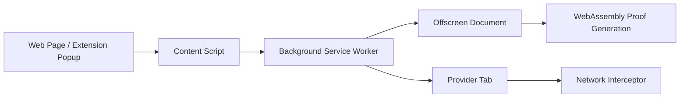

## Overview

Lightweight SDK for integrating Reclaim verification into browser extensions and websites. Handles content-background communication, provider tab management, WebAssembly proof generation, and completion events.

### Key Features

- 🔌 **Dual Integration**: Build extensions or integrate from web apps
- 🛡️ **Manifest V3 Compatible**: Full Chrome MV3 support
- ⚡ **WebAssembly Proofs**: High-performance cryptographic proof generation
- 🔄 **Event-Driven**: Real-time updates via clean event API
- 📦 **Pre-built Bundles**: No re-bundling required
- 🎯 **Auto Provider Management**: Automatic tab orchestration
- 🔐 **Network Monitoring**: Built-in request interception

## Two Integration Paths

### 1. Extension Integration (Primary)

**Build a browser extension** with Reclaim verification in popup/sidepanel:
- Users trigger verification from your extension UI
- Full control over extension experience
- SDK handles all Chrome extension complexity
- Manifest V3, offscreen documents, service workers

[Get Started with Extension Integration →](/browser-extension/extension-integration)

### 2. Web Integration (Optional)

**Trigger verification from your website** through a compatible extension:
- For websites that want to use an extension built with this SDK
- Users verify without leaving your site
- Extension handles verification, you control website UI
- Requires users to install compatible extension

[Learn About Web Integration →](/browser-extension/web-integration)

## How It Works

Multi-layer architecture for secure verification:

1. **Content Script Bridge** - Communication between pages and extension
2. **Background Service Worker** - Manages offscreen docs and provider tabs
3. **Offscreen Document** - WebAssembly proof generation
4. **Network Interceptor** - Captures network requests during verification

## Compatibility

**Browsers**: Chrome 93+, Edge 93+, Brave, Opera (Chromium-based)

**Requirements**: Node.js 14.x+, npm 6.x+ or yarn 1.22.x+, Manifest V3

## Next Steps

Choose your integration path:

1. **[Installation](/browser-extension/installation)** - Install the SDK and set up assets
2. **[Extension Integration](/browser-extension/extension-integration)** - Build a browser extension with Reclaim
3. **[Web Integration](/browser-extension/web-integration)** - Integrate from your website
4. **[Troubleshooting](/browser-extension/troubleshooting)** - Common issues and solutions

## Get an API Key

Before integrating, you'll need API credentials. Follow the [Get API Key guide](/api-key) to set up your Reclaim Protocol project.
