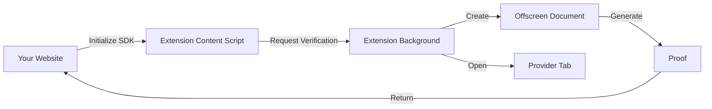

<Callout type="info">
**Optional Integration**: This section is for websites that want to integrate with an extension built using the Reclaim Browser Extension SDK. If you're building an extension with popup/sidepanel verification, use [Extension Integration](/browser-extension/extension-integration) instead.
</Callout>

## Overview

Trigger Reclaim verification from your website through an installed browser extension. Users can verify without leaving your site - the extension handles all verification logic.

## When to Use This

Choose web integration if:

- 🌐 **You have a website** (not building an extension)
- 🔌 **Users have a compatible extension** built with this SDK
- 🎨 **You control the website UI** (extension handles verification)
- 🔄 **You want in-page verification** without redirects

## How It Works

The web integration establishes communication between your website and the Reclaim browser extension:



### Flow Breakdown

1. **Your Website**: Calls SDK with extension ID
2. **Content Script Bridge**: Receives request from webpage
3. **Extension Background**: Orchestrates verification
4. **Offscreen Document**: Generates proofs
5. **Provider Tab**: Handles authentication
6. **Proofs Returned**: Sent back to your website

## Get Your API Credentials First

<Callout type="warning">
**🔑 Required: Get Your API Credentials Before Integration**

Before you can integrate Reclaim verification into your website, you **must** obtain your API credentials. These credentials (`APP_ID` and `APP_SECRET`) are essential for creating verification requests.

**[Get Your API Credentials Now →](/api-key)**

You'll need:
- **`APP_ID`**: Your unique application identifier
- **`APP_SECRET`**: Your application secret key (keep secure!)

Without these credentials, you cannot initialize the SDK or start verification flows.
</Callout>

## Prerequisites

Before integrating, ensure you have:

- ✅ Completed the [Installation guide](/browser-extension/installation)
- ✅ **Obtained your API credentials (`APP_ID` and `APP_SECRET`)** from the [API Key guide](/api-key)
- ✅ Access to a Reclaim-compatible browser extension (or built one using [Extension Integration](/browser-extension/extension-integration))
- ✅ A web application (React, Vue, vanilla JavaScript, etc.)

<Callout type="info">
**Extension Requirement**: Users must have a Reclaim-compatible extension installed. You can either:
1. Build your own extension using [Extension Integration](/browser-extension/extension-integration)
2. Use the official Reclaim extension (if available)
3. Partner with existing extension providers
</Callout>

## Key Differences from Extension Integration

| Aspect | Extension Integration | Web Integration |
|--------|----------------------|-----------------|
| **Who builds** | You build the extension | You use existing extension |
| **User installs** | Your extension | Any compatible extension |
| **Control** | Full control | Limited to verification API |
| **UI Location** | Extension popup/panel | Your website |
| **Complexity** | Higher (extension dev) | Lower (just web code) |

## Extension ID

The most important configuration for web integration is the **Extension ID**. This identifies which browser extension will handle verification requests.

### Finding the Extension ID

For Chrome extensions:

1. Navigate to `chrome://extensions`
2. Enable "Developer mode" (top-right toggle)
3. Find the extension
4. Copy the ID (shown under the extension name)

**Example ID**: `abcdefghijklmnopqrstuvwxyz123456`

### Storing the Extension ID

**Development**:
```javascript
// .env.local
VITE_RECLAIM_EXTENSION_ID=abcdefghijklmnopqrstuvwxyz123456
```

**Production**:
```javascript
// Use environment variables or configuration
const EXTENSION_ID = process.env.REACT_APP_RECLAIM_EXTENSION_ID;
```

<Callout type="warning">
**Extension ID Changes**: The extension ID changes between development and production builds. Ensure you use the correct ID for each environment.
</Callout>

## Architecture Benefits

### For Developers

- ✅ **No Extension Development**: Just integrate SDK in your web app
- ✅ **Faster Integration**: Standard web development workflow
- ✅ **Framework Agnostic**: Works with React, Vue, Angular, vanilla JS
- ✅ **Easier Updates**: Update your website without extension review process

### For Users

- ✅ **Single Extension**: One extension works across multiple websites
- ✅ **No Page Reloads**: Verification happens in-place
- ✅ **Trusted Source**: Extension from verified publisher
- ✅ **Consistent UX**: Familiar verification flow across sites

## Security Considerations

### Extension Trust

Users must trust the browser extension since it:
- Handles sensitive authentication flows
- Generates cryptographic proofs
- Has access to provider credentials

**Best Practices**:
- Use well-known, audited extensions
- Clearly communicate which extension is required
- Provide extension installation instructions
- Verify extension authenticity

### Website Security

Your website should:
- Validate proofs server-side (never trust client-side proofs alone)
- Use HTTPS for all communication
- Implement Content Security Policy (CSP)
- Handle extension not installed gracefully

## Browser Compatibility

Web integration works in browsers supporting Chrome extensions:

| Browser | Support | Notes |
|---------|---------|-------|
| Chrome | ✅ | Full support |
| Edge | ✅ | Chrome Web Store extensions work |
| Brave | ✅ | Chrome Web Store extensions work |
| Opera | ✅ | Chrome Web Store extensions work |
| Firefox | ⏳ | Coming soon (Firefox addons) |
| Safari | ⏳ | Coming soon (Safari extensions) |

## Integration Approaches

You have two approaches for web integration:

### 1. Direct Client-Side Integration (Quick Start)

Pass credentials directly in your frontend code. **Not recommended for production**.

**Pros**:
- ✅ Fastest to implement
- ✅ No backend required
- ✅ Good for prototypes

**Cons**:
- ❌ Exposes application secret
- ❌ Not secure for production
- ❌ Credentials visible in client code

[Quick Start Guide →](/browser-extension/web-integration/setup#quick-start)

### 2. Server-Side Configuration (Production)

Generate verification requests on your backend, only pass configuration to frontend.

**Pros**:
- ✅ Secure - secrets stay on server
- ✅ Backend validation
- ✅ User authorization
- ✅ Production-ready

**Cons**:
- ❌ Requires backend API
- ❌ More complex setup

[Production Setup →](/browser-extension/web-integration/setup#production-setup)

<Callout type="warning">
**Production Warning**: Never expose your Application Secret in client-side code. Always use server-side configuration for production deployments.
</Callout>

## Example Use Cases

### DeFi Applications

Verify user credentials before token operations:
```javascript
// Verify Twitter account before claiming tokens
const proofs = await verifyWithReclaim("twitter-profile");
await claimTokens(proofs);
```

### Social Platforms

Authenticate users with provider credentials:
```javascript
// Verify GitHub account for developer community
const proofs = await verifyWithReclaim("github-login");
await createProfile(proofs);
```

### Identity Verification

Proof of account ownership:
```javascript
// Verify Google account ownership
const proofs = await verifyWithReclaim("google-login");
await linkAccount(proofs);
```

## Next Steps

Proceed to setup and implementation:

1. **[Setup](/browser-extension/web-integration/setup)** - Configure SDK in your web application
2. **[Usage](/browser-extension/web-integration/usage)** - Implement verification flows
3. **[Troubleshooting](/browser-extension/troubleshooting)** - Common issues and solutions

## Extension Installation Guide

For users of your website, provide clear instructions:

```markdown
### Install the Reclaim Extension

1. Visit the [Chrome Web Store](https://chrome.google.com/webstore)
2. Search for "Reclaim Protocol"
3. Click "Add to Chrome"
4. Return to this page and click "Verify"
```

Or detect and prompt automatically (covered in [Usage guide](/browser-extension/web-integration/usage#checking-extension-installation)).
