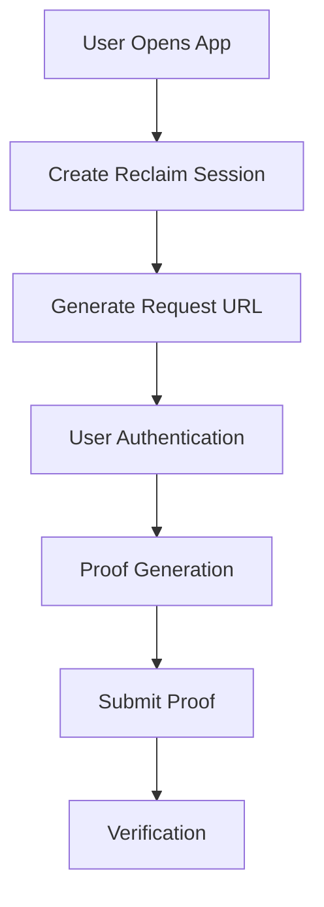

# Quick Start Guide: Reclaim Flutter SDK

## Getting Started
Start building with Reclaim in just a few simple steps:

1. [Installation](./flutter/installation)
   - Set up the Reclaim Flutter SDK in your project

2. [Flutter Example](./flutter/flutter-example)
   - Learn core concepts and implementation basics

## Understanding the Flow
Here's how Reclaim integrates with your Flutter application:

1. **Initial Access**: User launches your Flutter application
2. **Session Initialization**: Your app creates a new Reclaim session
3. **URL Generation**: System generates a secure request URL
4. **Authentication Flow**: User authenticates on the target platform (e.g., Amazon.com)
5. **Proof Creation**: System generates a cryptographic proof on the user's device
6. **Proof Handling**: User submits the proof back to your application
7. **Validation**: Your app verifies the proof's authenticity

## Implementation Options

Choose the approach that best fits your needs:

### Mobile-Only Implementation
✓ Best for:
- Quick prototypes
- MVP development
- Simple applications

### Full Stack Implementation
✓ Recommended for:
- Production applications
- Enhanced security requirements
- Custom authentication needs

## Practical Examples

Explore our implementation guides:

- [Fullstack Example](./flutter/fullstack-example)
  Comprehensive guide for backend-integrated implementation

## Advanced Features

Take your implementation further:

- [Advanced Configuration](../advance-configurations/advance-options)
  Detailed configuration options and customization

- [Best Practices](./flutter/best-practices)
  Optimization guidelines and recommended patterns

## Support Resources

Get help when you need it:

### Community Support
- [Telegram Community](https://t.me/protocolreclaim) - Join discussions and get help
- [Website](https://reclaimprotocol.org) - Access documentation and resources

### Stay Updated
- [Twitter](https://twitter.com/reclaimprotocol) - Latest updates and announcements
- [GitHub](https://github.com/reclaimprotocol/reclaim-flutter-sdk/) - Access source code and contribute

Ready to start building? Let's dive into the installation process!
