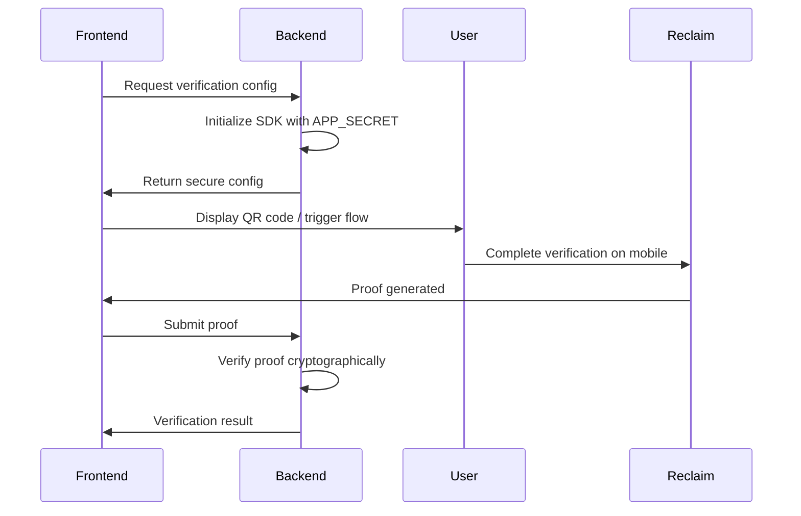

## Overview

The Reclaim JavaScript SDK enables you to integrate cryptographic proof generation and verification into your applications. Users can generate zero-knowledge proofs of their online data without exposing sensitive information, and your backend can verify these proofs securely.

### Key Features

- 🚀 **Multi-Platform Support**: Works in browsers, Node.js, React Native, and mobile webviews
- 🔐 **Zero-Knowledge Proofs**: Verify user data without accessing sensitive information
- 🎯 **Smart Platform Detection**: Automatically selects optimal verification flow (QR code, App Clip, Instant App, Browser Extension)
- ⚡ **Simple Integration**: One-line `triggerReclaimFlow()` handles the entire verification process
- 🛡️ **Backend Verification**: Cryptographically verify proofs on your server
- 🎨 **Customizable UI**: Configure modal appearance, themes, and callbacks
- 📱 **Mobile-First**: Native support for iOS App Clips and Android Instant Apps

## Two Integration Approaches

### 1. Client-Side Only (Development & Prototyping)

**Quick setup for development** - Initialize and handle everything in the browser:

- Initialize SDK directly in frontend
- Start verification session
- Receive proofs in frontend
- Save/process proofs client-side

**Use cases**: Development, prototyping, learning, proof-of-concept demos

<Callout type="warning">
**Security Note**: Use this approach for **development purposes only**.

If using client-side initialization:

- Store `APP_ID` and `APP_SECRET` in `.env` file (never hardcode)
- Never commit credentials to version control
- **Do not deploy to production** with this approach

**Recommended**: Always initialize from backend in production environments to keep `APP_SECRET` secure.

</Callout>

[Try Client-Side Quickstart →](/js-sdk/quickstart)

### 2. Backend Integration (Production-Ready) ⭐

**Secure full-stack approach** - Initialize from backend, verify proofs server-side:

**Flow**:

1. **Backend**: Initialize SDK with `APP_SECRET` (secure in `.env`)
2. **Backend**: Generate verification config/URL
3. **Frontend**: Start verification session with config from backend
4. **User**: Complete verification on mobile/extension
5. **Backend**: Receive proof via callback URL
6. **Backend**: Verify proof cryptographically
7. **Backend**: Process verified data and update your database

**Benefits**:

- ✅ `APP_SECRET` never exposed to client
- ✅ Proofs verified server-side before use
- ✅ Direct proof delivery to your backend via callback URL
- ✅ Production-ready and secure

<Callout type="success">
  **Best Practice**: This is the recommended approach for all production applications. The callback URL allows Reclaim to send proofs
  directly to your backend for verification, ensuring data integrity.
</Callout>

[See Backend Integration Guide →](/js-sdk/recommended-setup)

## How It Works

The Reclaim Protocol verification flow follows these steps:



### Workflow Steps

1. **Backend Initialization**: Your server initializes the SDK with `APP_ID` and `APP_SECRET` (kept secure)
2. **Request Generation**: Backend creates a verification request URL and returns config to frontend
3. **User Verification**: Frontend displays QR code or triggers appropriate flow based on device
4. **Proof Generation**: User completes verification via mobile (App Clip/Instant App) or browser extension
5. **Proof Submission**: Frontend receives the cryptographic proof and sends to backend
6. **Backend Verification**: Server verifies the proof's cryptographic signature and extracts verified data

## Platform Detection & Verification Methods

The SDK automatically detects the user's platform and chooses the best verification method:

| Platform                     | Verification Method           | User Experience                  |
| ---------------------------- | ----------------------------- | -------------------------------- |
| **Desktop Browser**          | QR Code + Mobile verification | User scans QR with mobile device |
| **iOS Safari**               | App Clip integration          | Seamless in-app verification     |
| **Android Chrome**           | Instant App                   | Seamless in-app verification     |
| **Desktop (with extension)** | Browser Extension             | In-browser verification          |

The `triggerReclaimFlow()` method handles all platform detection automatically.

<Callout type="info">
  **Note on Android**: Google is discontinuing Instant Apps support in December 2025. Reclaim Protocol has transitioned to deep linking for
  Android, providing a seamless verification experience without app installation. [Learn more
  →](https://blog.reclaimprotocol.org/posts/moving-beyond-google-play-instant)
</Callout>

## Advanced Configuration & Customization

The SDK provides extensive customization options for the verification flow and UI. All features from the [Reclaim JS SDK](https://github.com/reclaimprotocol/reclaim-js-sdk#advanced-configuration) can be used:

### Modal Customization

Configure the QR code modal appearance and behavior:

```javascript
reclaimProofRequest.setModalOptions({
  // Theme
  darkTheme: true, // Enable dark mode

  // Text customization
  title: "Verify Your Account",
  description: "Scan QR code with your mobile device",

  // Behavior
  modalPopupTimer: 5, // Auto-close after 5 minutes

  // Browser extension
  showExtensionInstallButton: true, // Show extension install prompt
  extensionUrl: "custom-extension-url",

  // Callbacks
  onClose: () => {
    console.log("Modal closed by user");
  },
});
```

### Context Addition

Add custom context/metadata to your proof requests:

```javascript
reclaimProofRequest.addContext("0x00000000000", "Custom context message or metadata");
```

### Browser Extension Configuration

Configure browser extension behavior during initialization:

```javascript
const reclaimProofRequest = await ReclaimProofRequest.init(APP_ID, APP_SECRET, PROVIDER_ID, {
  useBrowserExtension: true, // Enable/disable extension (default: true)
  extensionID: "custom-extension-id", // Custom extension identifier
});
```

### Check Extension Availability

Conditionally show UI based on extension availability:

```javascript
const hasExtension = await reclaimProofRequest.isBrowserExtensionAvailable();

if (hasExtension) {
  // Show "Verify with Extension" button
} else {
  // Show "Scan QR Code" message
}
```

### Session Callbacks

Handle verification results with detailed callbacks:

```javascript
await reclaimProofRequest.startSession({
  onSuccess: (proofs) => {
    // Handle successful verification
    // proofs can be either a string message or proof object
    console.log("Verification successful:", proofs);
  },
  onFailure: (error) => {
    // Handle verification errors
    console.error("Verification failed:", error);
  },
});
```

For complete configuration options and examples, see the [Advanced Configuration documentation](https://github.com/reclaimprotocol/reclaim-js-sdk#advanced-configuration).

## Framework Support

The SDK works seamlessly with popular frameworks:

- ✅ **React** - Hooks and components
- ✅ **Next.js** - API routes + frontend integration
- ✅ **Vue.js** - Composables and reactive integration
- ✅ **Vanilla JavaScript** - Framework-agnostic
- ✅ **React Native** - Mobile app integration
- ✅ **Node.js** - Express, Fastify, NestJS
- ✅ **Python** - FastAPI, Django, Flask

## Security Best Practices

<Callout type="warning">

**Critical Security Requirements**

1. **Never expose APP_SECRET in frontend code** - Always initialize from backend
2. **Use environment variables** - Store credentials in `.env` files
3. **Verify proofs on backend** - Never trust client-side verification alone
4. **Use HTTPS** - Protect data in transit
5. **Validate proof structure** - Check all required fields before processing

</Callout>

## Next Steps

Choose your integration path:

1. **[Installation](/js-sdk/installation)** - Install the SDK via npm or yarn
2. **[Quickstart](/js-sdk/quickstart)** - Quick client-side demo for learning (dev only)
3. **[Recommended Setup](/js-sdk/recommended-setup)** - Production-ready backend initialization ⭐
4. **[API Reference](/js-sdk/api-reference)** - Complete SDK documentation
5. **[Troubleshooting](/js-sdk/troubleshooting)** - Common issues and solutions

## Get API Credentials

Before integrating, you'll need API credentials (`APP_ID`, `APP_SECRET`, and `PROVIDER_ID`). Follow the [Get API Key guide](/api-key) to set up your Reclaim Protocol project.

## Need Help?

- 📖 [Complete API Reference](/js-sdk/api-reference)
- 🐛 [Troubleshooting Guide](/js-sdk/troubleshooting)
- 💬 [Community Discord](https://discord.gg/reclaim)
- 🔗 [GitHub Repository](https://github.com/reclaimprotocol/reclaim-js-sdk)
