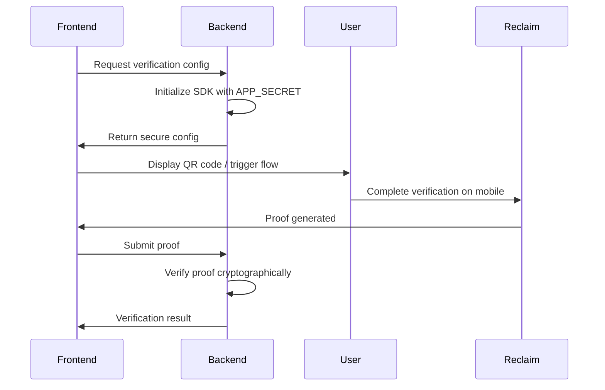

## Overview

The Reclaim JavaScript SDK enables you to integrate cryptographic proof generation and verification into your applications. Users can generate zero-knowledge proofs of their online data without exposing sensitive information, and your backend can verify these proofs securely.

### Key Features

- 🚀 **Multi-Platform Support**: Works in browsers, Node.js, React Native, and mobile webviews
- 🔐 **Zero-Knowledge Proofs**: Verify user data without accessing sensitive information
- 🎯 **Smart Platform Detection**: Automatically selects optimal verification flow (QR code, App Clip, Instant App, Browser Extension)
- ⚡ **Simple Integration**: One-line `triggerReclaimFlow()` handles the entire verification process
- 🛡️ **Backend Verification**: Cryptographically verify proofs on your server
- 🎨 **Customizable UI**: Configure modal appearance, themes, and callbacks
- 📱 **Mobile-First**: Native support for iOS App Clips and Android Instant Apps

## Get Your API Credentials

<Callout type="warning">
**🔑 Required: Get Your API Credentials First**

Before you can use the SDK, you **must** obtain your API credentials from the Reclaim Protocol dashboard.

**[Get Your API Credentials Now →](/api-key)**

You'll need:
- **`APP_ID`**: Your unique application identifier
- **`APP_SECRET`**: Your application secret key (keep secure!)
- **`PROVIDER_ID`**: The data provider you want to verify (e.g., "google-login")

These credentials are required for all code examples below.
</Callout>

## Quick Start

Want to see it in action? Here's a practical React example to get started:

<Callout type="warning">
**⚠️ Development Only**

This example initializes the SDK client-side for quick testing and learning. **Never use this approach in production** as it exposes your `APP_SECRET` in the frontend code.

**For production apps:** See [Recommended Setup →](/js-sdk/recommended-setup) below.
</Callout>

### Installation

First, install the SDK:

```bash
npm install @reclaimprotocol/js-sdk
```

### React Example

```jsx
import React, { useState, useEffect } from 'react';
import { ReclaimProofRequest } from '@reclaimprotocol/js-sdk';

function App() {
  const [reclaimProofRequest, setReclaimProofRequest] = useState(null);
  const [proofs, setProofs] = useState(null);
  const [loading, setLoading] = useState(false);
  const [error, setError] = useState(null);

  // Initialize the SDK
  useEffect(() => {
    async function initializeReclaim() {
      try {
        const proofRequest = await ReclaimProofRequest.init(
          'YOUR_APP_ID',
          'YOUR_APP_SECRET',
          'YOUR_PROVIDER_ID'
        );
        setReclaimProofRequest(proofRequest);
      } catch (err) {
        setError('Failed to initialize SDK: ' + err.message);
      }
    }
    initializeReclaim();
  }, []);

  // Handle verification
  async function handleVerification() {
    if (!reclaimProofRequest) return;

    setLoading(true);
    setError(null);

    try {
      // Trigger the verification flow (auto-detects platform)
      await reclaimProofRequest.triggerReclaimFlow();

      // Start session and handle results
      await reclaimProofRequest.startSession({
        onSuccess: (proofs) => {
          console.log('Verification successful:', proofs);
          setProofs(proofs);
          setLoading(false);
        },
        onFailure: (error) => {
          console.error('Verification failed:', error);
          setError(error.message || 'Verification failed');
          setLoading(false);
        },
      });
    } catch (err) {
      setError(err.message || 'Failed to start verification');
      setLoading(false);
    }
  }

  return (
    <div style={{ padding: '20px', fontFamily: 'system-ui' }}>
      <h1>Reclaim Protocol Demo</h1>

      <button
        onClick={handleVerification}
        disabled={!reclaimProofRequest || loading}
        style={{
          padding: '12px 24px',
          fontSize: '16px',
          backgroundColor: loading ? '#ccc' : '#4CAF50',
          color: 'white',
          border: 'none',
          borderRadius: '4px',
          cursor: loading ? 'not-allowed' : 'pointer'
        }}
      >
        {loading ? 'Verifying...' : 'Start Verification'}
      </button>

      {error && (
        <div style={{ color: 'red', marginTop: '20px' }}>
          <strong>Error:</strong> {error}
        </div>
      )}

      {proofs && (
        <div style={{ marginTop: '20px' }}>
          <h3>✅ Verification Successful!</h3>
          <pre style={{
            background: '#f5f5f5',
            padding: '15px',
            borderRadius: '4px',
            overflow: 'auto'
          }}>
            {JSON.stringify(proofs, null, 2)}
          </pre>
        </div>
      )}
    </div>
  );
}

export default App;
```

**Try other frameworks?** See [Quickstart Guide →](/js-sdk/quickstart) for vanilla JavaScript, Vue, and more examples.

**Ready for production?** Check out our [Recommended Setup →](/js-sdk/recommended-setup) with secure backend integration.

## Two Integration Approaches

### 1. Client-Side Only (Development & Prototyping)

**Quick setup for development** - Initialize and handle everything in the browser (like the example above):

- Initialize SDK directly in frontend
- Start verification session
- Receive proofs in frontend
- Save/process proofs client-side

**Use cases**: Development, prototyping, learning, proof-of-concept demos

<Callout type="warning">
**Security Note**: This approach is for **development purposes only**.

- Store `APP_ID` and `APP_SECRET` in `.env` file (never hardcode)
- Never commit credentials to version control
- **Do not deploy to production** with this approach

**Recommended**: Always initialize from backend in production environments to keep `APP_SECRET` secure.
</Callout>

[See More Client-Side Examples →](/js-sdk/quickstart)

### 2. Backend Integration (Production-Ready) ⭐

**Secure full-stack approach** - Initialize from backend, verify proofs server-side:

**Flow**:

1. **Backend**: Initialize SDK with `APP_SECRET` (secure in `.env`)
2. **Backend**: Generate verification config/URL
3. **Frontend**: Start verification session with config from backend
4. **User**: Complete verification on mobile/extension
5. **Backend**: Receive proof via callback URL
6. **Backend**: Verify proof cryptographically
7. **Backend**: Process verified data and update your database

**Benefits**:

- ✅ `APP_SECRET` never exposed to client
- ✅ Proofs verified server-side before use
- ✅ Direct proof delivery to your backend via callback URL
- ✅ Production-ready and secure

<Callout type="success">
  **Best Practice**: This is the recommended approach for all production applications. The callback URL allows Reclaim to send proofs
  directly to your backend for verification, ensuring data integrity.
</Callout>

[See Backend Integration Guide →](/js-sdk/recommended-setup)

## How It Works

The Reclaim Protocol verification flow follows these steps:



### Workflow Steps

1. **Backend Initialization**: Your server initializes the SDK with `APP_ID` and `APP_SECRET` (kept secure)
2. **Request Generation**: Backend creates a verification request URL and returns config to frontend
3. **User Verification**: Frontend displays QR code or triggers appropriate flow based on device
4. **Proof Generation**: User completes verification via mobile (App Clip/Instant App) or browser extension
5. **Proof Submission**: Frontend receives the cryptographic proof and sends to backend
6. **Backend Verification**: Server verifies the proof's cryptographic signature and extracts verified data

## Platform Detection & Verification Methods

The SDK automatically detects the user's platform and chooses the best verification method:

| Platform                     | Verification Method           | User Experience                  |
| ---------------------------- | ----------------------------- | -------------------------------- |
| **Desktop Browser**          | QR Code + Mobile verification | User scans QR with mobile device |
| **iOS Safari**               | App Clip integration          | Seamless in-app verification     |
| **Android Chrome**           | Instant App                   | Seamless in-app verification     |
| **Desktop (with extension)** | Browser Extension             | In-browser verification          |

The `triggerReclaimFlow()` method handles all platform detection automatically.

<Callout type="info">
  **Note on Android**: Google is discontinuing Instant Apps support in December 2025. Reclaim Protocol has transitioned to deep linking for
  Android, providing a seamless verification experience without app installation. [Learn more
  →](https://blog.reclaimprotocol.org/posts/moving-beyond-google-play-instant)
</Callout>

## Advanced Configuration

The SDK provides extensive customization options for the verification flow and UI:

- **Modal Customization**: Configure QR code modal appearance, themes, and behavior
- **Custom Parameters**: Add metadata with `setParams()` and `addContext()`
- **Browser Extension**: Configure extension detection and behavior
- **Callback URLs**: Set backend callback URLs for direct proof delivery
- **Custom Redirects**: Configure post-verification redirect URLs
- **Session Callbacks**: Handle `onSuccess` and `onFailure` events

For complete configuration options, methods, and code examples, see the **[API Reference →](/js-sdk/api-reference#advanced-configuration)**

## Framework Support

The SDK works seamlessly with popular frameworks:

- ✅ **React** - Hooks and components
- ✅ **Next.js** - API routes + frontend integration
- ✅ **Vue.js** - Composables and reactive integration
- ✅ **Vanilla JavaScript** - Framework-agnostic
- ✅ **React Native** - Mobile app integration
- ✅ **Node.js** - Express, Fastify, NestJS
- ✅ **Python** - FastAPI, Django, Flask

## Security Best Practices

<Callout type="warning">

**Critical Security Requirements**

1. **Never expose APP_SECRET in frontend code** - Always initialize from backend
2. **Use environment variables** - Store credentials in `.env` files
3. **Verify proofs on backend** - Never trust client-side verification alone
4. **Use HTTPS** - Protect data in transit
5. **Validate proof structure** - Check all required fields before processing

</Callout>

## Next Steps

Choose your integration path:

1. **[Installation](/js-sdk/installation)** - Install the SDK via npm or yarn
2. **[Quickstart](/js-sdk/quickstart)** - More client-side examples (vanilla JS, Vue, etc.)
3. **[Recommended Setup](/js-sdk/recommended-setup)** - Production-ready backend integration ⭐
4. **[API Reference](/js-sdk/api-reference)** - Complete SDK documentation & advanced config
5. **[Troubleshooting](/js-sdk/troubleshooting)** - Common issues and solutions

## Need Help?

- 📖 [Complete API Reference](/js-sdk/api-reference)
- 🐛 [Troubleshooting Guide](/js-sdk/troubleshooting)
- 💬 [Community Discord](https://discord.gg/reclaim)
- 🔗 [GitHub Repository](https://github.com/reclaimprotocol/reclaim-js-sdk)
