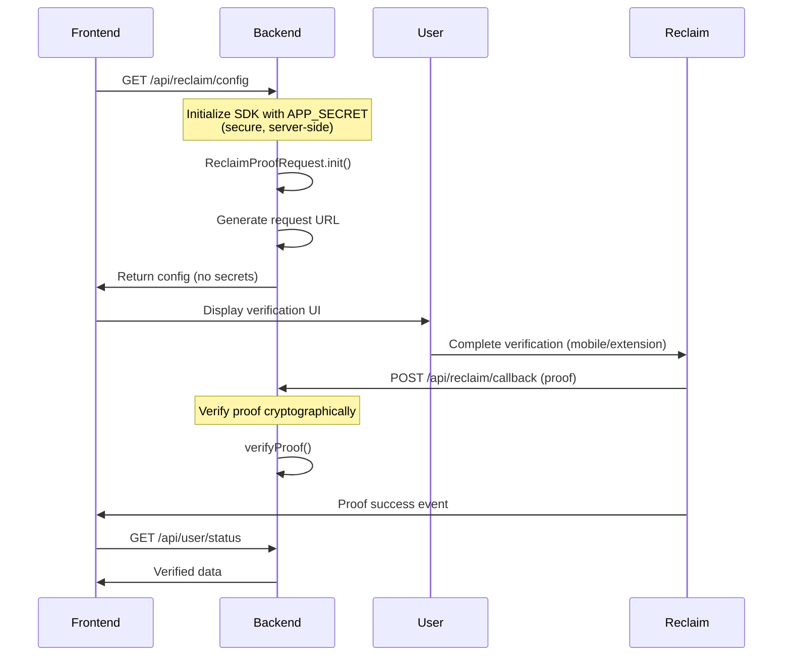

<Callout type="success">
**✅ Production-Ready Approach**

This is the **recommended way** to integrate Reclaim Protocol in production applications. Your `APP_SECRET` stays secure on your backend, never exposed to the client.
</Callout>

<Callout type="info">
**SDK Installation Required**

You need to install the appropriate SDK for your backend:

- **Node.js/JavaScript**: Install `@reclaimprotocol/js-sdk`
  ```bash
  npm install @reclaimprotocol/js-sdk
  ```

- **Python**: Install `reclaim-python-sdk`
  ```bash
  pip install reclaim-python-sdk
  ```

Each setup guide below includes detailed installation instructions.
</Callout>

## Overview

The recommended setup separates sensitive operations (SDK initialization with `APP_SECRET`) from client-side operations (UI and proof display). This architecture ensures:

- ✅ **APP_SECRET stays secure** - Never exposed in browser code
- ✅ **Backend verification** - Proofs are verified server-side before use
- ✅ **Scalability** - Centralized configuration management
- ✅ **Auditability** - All verifications logged on your server

## Architecture



## How It Works

### Step 1: Backend Initialization (Secure)

Your backend initializes the SDK with `APP_SECRET` from environment variables:

```javascript
// Backend: Initialize SDK securely
const reclaimProofRequest = await ReclaimProofRequest.init(
  process.env.RECLAIM_APP_ID,      // From .env - secure
  process.env.RECLAIM_APP_SECRET,  // From .env - NEVER exposed
  process.env.RECLAIM_PROVIDER_ID  // From .env - secure
);
```

### Step 2: Generate Configuration

Backend generates a configuration object that's safe to send to the frontend:

```javascript
// Set callback URL for proof verification
reclaimProofRequest.setAppCallbackUrl('https://yourapp.com/api/reclaim/callback');

// Convert to JSON string (no secrets included)
const config = reclaimProofRequest.toJsonString();

// Send to frontend
res.json({ reclaimProofRequestConfig: config });
```

### Step 3: Frontend Reconstruction

Frontend receives the config and reconstructs the proof request:

```javascript
// Frontend: Reconstruct from config
const reclaimProofRequest = await ReclaimProofRequest.fromJsonString(config);

// Trigger verification flow
await reclaimProofRequest.triggerReclaimFlow();
```

### Step 4: Backend Verification

When the user completes verification, Reclaim sends the proof to your callback URL:

```javascript
// Backend: Verify the proof
const isValid = await verifyProof(proof);

if (isValid) {
  // Process verified data, update database, etc.
}
```

## Security Best Practices

<Callout type="warning">
**Critical Security Requirements**

1. **Never expose APP_SECRET** - Always keep it on the backend in environment variables
2. **Use HTTPS** - All production deployments must use HTTPS
3. **Verify proofs backend-side** - Never trust client-side verification alone
4. **Set callback URL** - Let Reclaim send proofs directly to your server
5. **Validate proof structure** - Check all required fields before processing
6. **Use environment variables** - Never hardcode credentials
</Callout>

## Environment Setup

### .env File (Backend Only)

```bash
# .env - Backend only, never commit to git
RECLAIM_APP_ID=your_app_id_here
RECLAIM_APP_SECRET=your_app_secret_here
RECLAIM_PROVIDER_ID=your_provider_id_here

# Your app's base URL
BASE_URL=https://yourapp.com

# For local development with ngrok
# BASE_URL=https://abc123.ngrok.io
```

### .gitignore

Ensure credentials are never committed:

```bash
# .gitignore
.env
.env.local
.env.*.local
```

## Implementation by Framework

Choose your backend framework to see detailed implementation:

<div className="grid grid-cols-1 md:grid-cols-3 gap-4 mt-6">
  <a href="/js-sdk/recommended-setup/nodejs" className="card">
    <h3>Node.js / Express</h3>
    <p>Express.js backend with React frontend</p>
  </a>

  <a href="/js-sdk/recommended-setup/nextjs" className="card">
    <h3>Next.js</h3>
    <p>Full-stack Next.js with API routes</p>
  </a>

  <a href="/js-sdk/recommended-setup/python" className="card">
    <h3>Python</h3>
    <p>FastAPI or Django implementation</p>
  </a>
</div>

## Key API Endpoints

### 1. Generate Config Endpoint

**Purpose**: Securely initialize SDK and return safe config to frontend

```
GET /api/reclaim/config
```

**Response**:
```json
{
  "reclaimProofRequestConfig": "{...safe config without secrets...}"
}
```

### 2. Receive Proofs Endpoint (Callback)

**Purpose**: Receive and verify proofs from Reclaim Protocol

```
POST /api/reclaim/callback
```

**Request Body**: URL-encoded proof object

**Response**: 200 OK if verification succeeds

## Local Development with ngrok

When developing locally, you need a public URL for the callback endpoint:

### Install ngrok

```bash
# macOS (Homebrew)
brew install ngrok

# Or download from https://ngrok.com/download
```

### Start ngrok Tunnel

```bash
# Tunnel to your local server (e.g., port 3000)
ngrok http 3000
```

You'll see output like:

```
Forwarding  https://abc123.ngrok.io -> http://localhost:3000
```

### Update Your .env

```bash
BASE_URL=https://abc123.ngrok.io
```

<Callout type="info">
**ngrok Tip**: The free tier generates a new URL each time. Consider using the paid tier for a persistent domain during development, or use ngrok's configuration to set a custom subdomain.
</Callout>

## Testing the Integration

### 1. Test Config Generation

```bash
curl https://yourapp.com/api/reclaim/config
```

Should return:
```json
{
  "reclaimProofRequestConfig": "{...}"
}
```

### 2. Test Callback Endpoint

You can manually test the callback with a mock proof:

```bash
curl -X POST https://yourapp.com/api/reclaim/callback \
  -H "Content-Type: application/x-www-form-urlencoded" \
  -d '{"identifier":"test","claimData":{}}'
```

## Error Handling

### Backend Initialization Errors

```javascript
app.get('/api/reclaim/config', async (req, res) => {
  try {
    const reclaimProofRequest = await ReclaimProofRequest.init(
      process.env.RECLAIM_APP_ID,
      process.env.RECLAIM_APP_SECRET,
      process.env.RECLAIM_PROVIDER_ID
    );

    // ... rest of code
  } catch (error) {
    console.error('SDK initialization failed:', error);

    if (error.message.includes('Invalid credentials')) {
      return res.status(401).json({ error: 'Invalid API credentials' });
    }

    if (error.message.includes('Provider not found')) {
      return res.status(404).json({ error: 'Provider not configured' });
    }

    return res.status(500).json({ error: 'Failed to initialize SDK' });
  }
});
```

### Proof Verification Errors

```javascript
app.post('/api/reclaim/callback', async (req, res) => {
  try {
    const proof = parseProof(req.body);

    if (!proof || !proof.identifier) {
      return res.status(400).json({ error: 'Invalid proof format' });
    }

    const isValid = await verifyProof(proof);

    if (!isValid) {
      console.warn('Proof verification failed:', proof.identifier);
      return res.status(400).json({ error: 'Proof verification failed' });
    }

    // Process valid proof
    res.sendStatus(200);
  } catch (error) {
    console.error('Error processing proof:', error);
    res.status(500).json({ error: 'Internal server error' });
  }
});
```

## Production Checklist

Before deploying to production:

- [ ] APP_SECRET is in environment variables (never in code)
- [ ] .env file is in .gitignore
- [ ] HTTPS is enabled for all endpoints
- [ ] Callback URL is publicly accessible
- [ ] Backend verifies all proofs before processing
- [ ] Error handling is implemented
- [ ] Logging is set up for audit trail
- [ ] Rate limiting is configured
- [ ] Database stores verification results
- [ ] User sessions/authentication is integrated

## Next Steps

1. **Choose your framework** and follow the detailed guide:
   - [Node.js / Express →](/js-sdk/recommended-setup/nodejs)
   - [Next.js →](/js-sdk/recommended-setup/nextjs)
   - [Python →](/js-sdk/recommended-setup/python)

2. **[Backend Verification →](/js-sdk/backend-verification)** - Deep dive into proof verification

3. **[API Reference →](/js-sdk/api-reference)** - Complete SDK documentation

## Need Help?

- 📖 [Troubleshooting Guide](/js-sdk/troubleshooting)
- 💬 [Community Discord](https://discord.gg/reclaim)
- 🐛 [GitHub Issues](https://github.com/reclaimprotocol/reclaim-js-sdk/issues)
